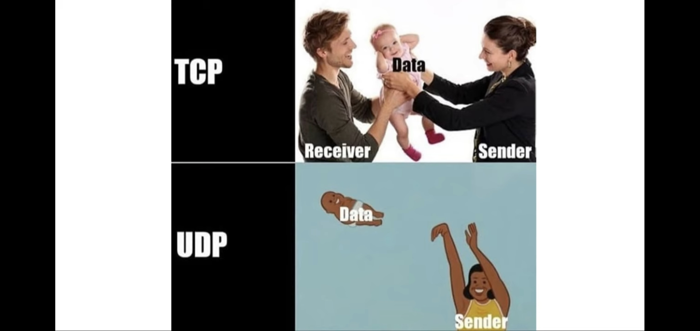

# 7 UDPソケットを使ったマルチキャスト通信

## 7.1 UDP と TCP の用途の違い

from: https://www.reddit.com/r/ProgrammerHumor/comments/krft3r/tcp_vs_udp/  
  

- UDP
  - 複数のコンピューターに同時にメッセージを送ることが可能なマルチキャストとブロードキャストをサポート
- UDPを使用しているプロトコル
  - DNS
  - NTP : 時計合わせのプロトコル
  - ストリーミング動画・音声プロトコル
  - WebRTC : ブラウザ上で行う P2P のための動画・音声通信プロトコル
- TCPとUDPの中間的なプロトコル
  - RUDP : 再送処理とウインドウ制御だけを TCP から UDP に移植
  - DTLS : UDP に TLS による暗号化を載せつつハンドシェイクだけは行う

### 7.1.1 UDP が使われる場面は昔と今で変わってきている

- いまのVPN
  - SSL-VPNが増えた。SSL-VPNのうち、パケットをHTTPSで包む方式あり
- いまのDNS
  - レスポンスが512バイトを超えたらTCPにフォールバック
- いまの独自プロトコル
  - エラー処理を作り込む必要あり
- TCPのバージョンがあがり、高性能になった

> アプリケーション開発という視点で見れば、「ロスしてもよい、ロスしても順序が変わってもアプリケーションレイヤーでカバーできる、マルチキャストが必要、ハンドシェイクの手間すら惜しいなど、いくつかの特別な条件に合致する場合以外はTCP」という選択でよいでしょう。

- QUIC
  - トランスポート層のプロトコル
  - TCPのレイヤーを軽量化、UDP使用、TLSの暗号化を合体
  - QUIC上ではHTTP/3が動作する
  - エラー処理はQUICのレイヤーで行う

## 7.2 UDP と TCP の処理の流れの違い

### 7.2.1 サーバー側の実装例

[server](01-unicast/server/main.go)  

### 7.2.2 クライアント側の実装例

[client](01-unicast/client/main.go)  

- POSIXでは、直接`recvfrom()`や`sendto()`で通信してよい (コネクションを確立するステップがない)
  - server: `listen()`, `accept()`不要
  - client: `connect()`不要

## 7.3 UDP のマルチキャストの実装例

- マルチキャスト
  - 送信元からマルチキャストアドレスにデータを送信
  - マルチキャストアドレスに属するポートにデータが届く
  - ブロードキャストと違って、同一LAN内のすべてのポートにデータが届くわけではない
  - IANAという団体が管理している
  - 用途 : 大容量データ配信（動画など）
- ブロードキャスト
  - 送信元からブロードキャストアドレスにデータを送信
  - 同一LAN内のすべてのポートにデータが届く
  - 用途 : DHCP、ルーティング情報の更新

### 7.3.1 サーバー側の実装

[server](02-multicast/server/main.go)

### 7.3.2 クライアント側の実装

[client](02-multicast/client/main.go)

## 7.4 UDP を使った実世界のサンプル

### 7.4.1 NTP

- Network Time Protocol
  - 木構造
  - ルートサーバは原子時計などを参照し、1階層下のクライアントに時刻を渡す
  - クライアントは通信遅延の補正して現在時刻を設定。さらに下のクライアントに渡していく
- [2036年問題](https://japan.zdnet.com/glossary/exp/2036%E5%B9%B4%E5%95%8F%E9%A1%8C/#:~:text=2036%E5%B9%B4%E5%95%8F%E9%A1%8C%E3%81%A8%E3%81%AF&text=2036%E5%B9%B4%E5%95%8F%E9%A1%8C%E3%81%A8%E3%81%AF%E3%80%81%E3%82%B3%E3%83%B3%E3%83%94%E3%83%A5%E3%83%BC%E3%82%BF%E3%81%AE%E6%99%82%E5%88%BB%E3%82%92%E5%90%8C%E6%9C%9F,%E5%95%8F%E9%A1%8C%E3%81%AE%E3%81%93%E3%81%A8%E3%81%A7%E3%81%82%E3%82%8B%E3%80%82)
  - 1900/01/01 00:00:00 (UTC) から 2^32秒後の 2036/02/06 00:54:54 (UTC) にオーバーフロー

### 7.4.2 同じネットワーク内部で仲間を探す

- `golang.org` : 標準ライブラリ
- `golang.org/x` : 準標準ライブラリ
  - C++のBoostみたいな？
- マルチキャストの実装には[github.com/schollz/peerdiscovery](https://github.com/schollz/peerdiscovery)が便利
  - 内部で`golang.org/x`を使用している

## 7.5 UDP と TCP の機能面の違い

- RTT (Round-Trip Time)
  - 往復レイテンシ
  - 通信相手にデータを送信してから応答が返ってくるまでの時間
- TCP
  - 通信確率時の3way handshakeに1.5RTTかかる
- UDP
  - 通信確率なんてしないので0RTT

### 7.5.1 TCP には再送処理とフロー処理がある

- 再送処理
  - 送信側が受信側にデータを送信
  - 受信側は受信データのシーケンス番号とペイロードサイズの合計を確認応答番号として送信側に返信
  - 送信側が確認応答番号を受信できなかったら、同じデータを再送信
- ウインドウ制御
  - コネクション確立時に受信用のバッファ（ウインドウ）のサイズを互いに伝える
  - 送信側はウインドウサイズまでは受信側からの受信確認（ACK）を待たずに連続でデータを送信可能
- フロー制御
  - 受信側の負荷が高まってデータを処理しきれない場合がある
  - ウインドウサイズを小さくして送信側に伝える
  - 受信可能になったらウインドウサイズを大きくして通知する

参考: https://www.infraexpert.com/study/tcpip11.html  

### 7.5.2 UDP ではフレームサイズも気にしよう

- 最大転送単位, MTU (Maximum Transmission Unit)
  - 一回のデータ転送で送信可能なIPデータグラムの最大値
  - `{フレームサイズ} - {ヘッダーサイズ}`
  - TCPヘッダー、UDPヘッダー、（PPPやVPNでカプセル化されてたらそれらのヘッダー）もここに含まれるので、実データ領域は小さい
  - 一般的なイーサネットのMTUは1500オクテット（バイト）
- IPフラグメンテーション
  - MTUに収まらないデータは、IPレベルで複数のパケットに分割される

ちなみに  
`イーサネットフレーム = イーサネットヘッダー + IPパケット`  

参考: https://www.infraexpert.com/info/5adsl.htm  

### 7.5.3 輻輳制御とフェアネス

- 輻輳制御（ふくそうせいぎょ）
  - ネットワークの輻輳（渋滞）を避けるように、送信側が通信量を調整すること
  - その回線を利用している者全員が、必要な最大速度を得られるようにする（フェアネス）
  - TCPにはあるが、UDPにはない
- 輻輳ウインドウ
  - 
