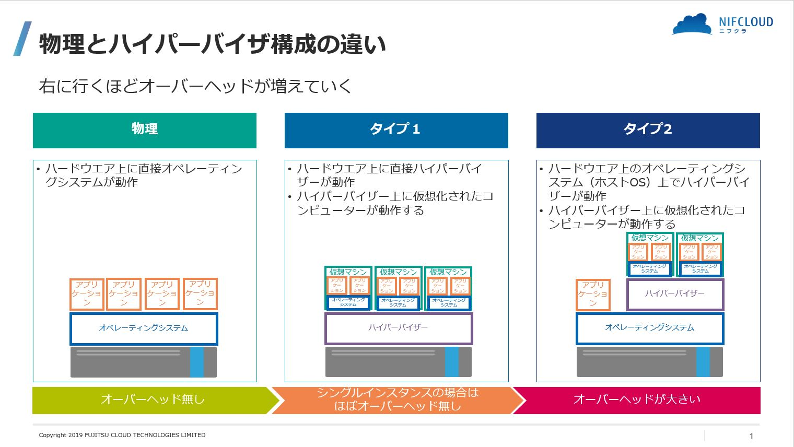

# 第19章 Go言語とコンテナ

## 19.1 仮想化

ハードウェアとOSの間にレイヤーを設けることで、1台のハードウェア上に複数のOSやシステムを安全に共存させること。  
クラウドを支える重要技術。  

### 仮想化の種類
- エミュレーション
  - CPUを完全にエミュレーションすることで別のハードウェアのソフトも動かせる
  
  - ref: [仮想化入門（ハイパーバイザー）](https://qiita.com/inasato/items/8489f2234160707c0110)
  - Type 1 : 準仮想化
    - ex. KVM, Hyper-V, VMWare vSphere
  - Type 2 : 完全仮想化
    - ex. VirtualBox, VMWare vSphere

- ネイティブ仮想化
  - 同じアーキテクチャのCPUに限定
  - エミュレーション不要なので高速

### 19.1.1 仮想化は低レイヤーの技術の組み合わせ

- [PopekとGoldbergの仮想化要件](https://ja.wikipedia.org/wiki/Popek%E3%81%A8Goldberg%E3%81%AE%E4%BB%AE%E6%83%B3%E5%8C%96%E8%A6%81%E4%BB%B6)
  - ゲストOSで実行したシステムコールなどの特権命令が、ホストOSや他のゲストOSに影響を起こしちゃだめ
  - あといろいろ
- Intel系CPUで「PopekとGoldbergの仮想化要件」を満たすための機能
  - VT-x
    - ユーザーモード、特権モード、ハイパーバイザー用OSのモード（<- new）
  - 拡張ページテーブル
    - ホストOSとゲストOSのメモリアドレスを変換
  - VT-d
    - PCIパススルー（ホストOSを介さずに外部ハードウェアにアクセス）
  - VT-c
    - ネットワーク仮想化

### 19.1.2 準仮想化

## 19.2 コンテナ

## 19.3 Windows Subsystem for Linux 2（WSL2）

- WSL1
  - Linuxのシステムコールを逐一Windowsの命令に翻訳する仕組み
  - 互換性はいまいち
  - Windows - Linux間のファイルIOは速い
- WSL2
  - 完全なLinuxカーネルを軽量なVM環境で動作させる仕組み
  - WSL2が入っている環境では、WindowsもLinuxカーネルもハイパーバイザー（Hyper-V）上に乗っている
  - initプロセスが特殊な実装に置き換えられている
    - 今はsystemdも設定したら使える（ https://learn.microsoft.com/ja-jp/windows/wsl/systemd ）
  - Linuxカーネル以外のOS部分はコンテナのような仕組み
    - ref: [ここが変だよ「WSL2」](https://logmi.jp/tech/articles/326106)
    > なので実はWSLの各ディストロは、WSL自体は1個のVMなのですが、その中の各ディストロはコンテナというおもしろい小ネタです。
  - Windows - Linux間のファイルIOはネットワークファイルシステムのプロトコルを使っているので遅い

## 19.4 libcontainerでコンテナを自作する
